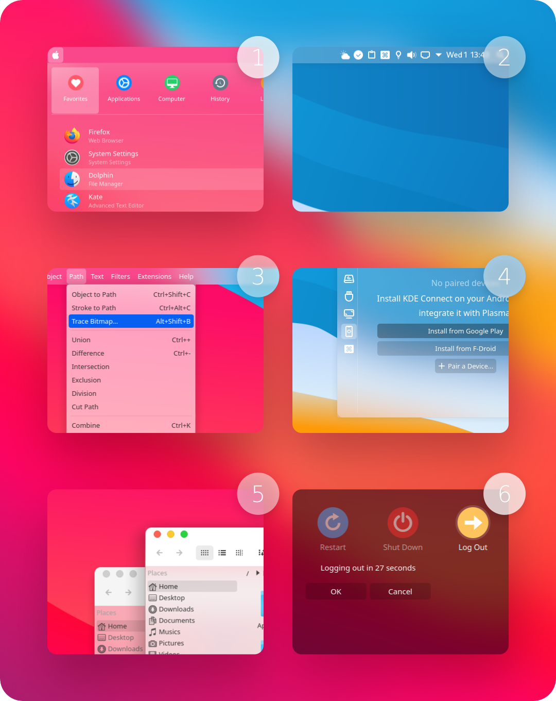
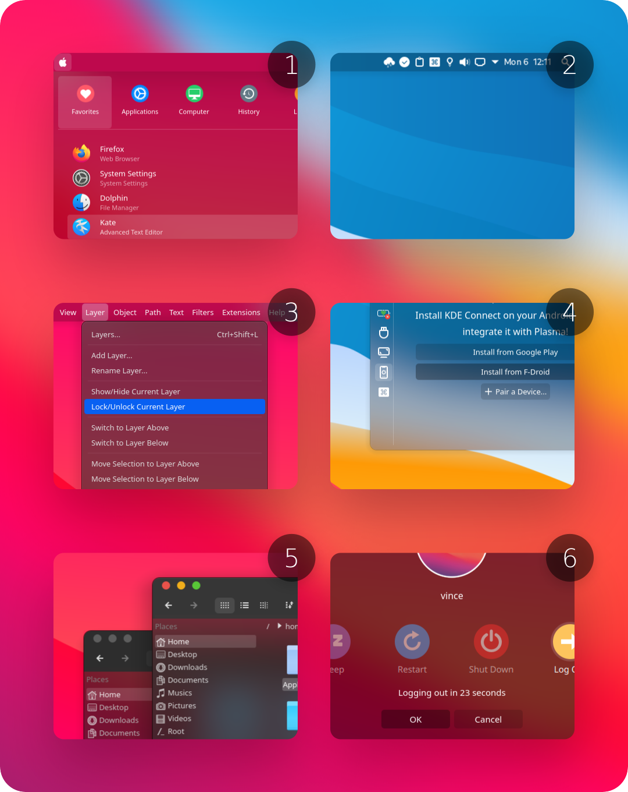

 WhiteSur KDE Theme
======

WhiteSur kde is a MacOS big sur like theme for KDE Plasma desktop.

In this repository you'll find:

- Aurorae Theme
- Kvantum Theme
- Wallpaper Theme
- Plasma Color Scheme
- Plasma Desktop Theme
- Plasma Global Theme

## Installation

```sh
./install.sh
```

install sharp aurorae windows manager theme:

```sh
./install.sh --sharp
```

install opaque theme version:

```sh
./install.sh --opaque
```

## Recommendations

- For better looking please use this pack with [Kvantum engine](https://github.com/tsujan/Kvantum/blob/master/Kvantum/INSTALL.md#distributions).

  Run `kvantummanager` to choose and apply **WhiteSur** (or any other WhiteSur) theme.

- Install [WhiteSur icon theme](https://github.com/vinceliuice/WhiteSur-icon-theme) for a more consistent and beautiful experience.

- Install [WhiteSur cursors theme](https://github.com/vinceliuice/WhiteSur-cursors) for a more consistent and beautiful experience.

## Donate

If you like my project, you can donate at:

<span class="paypal"><a href="https://www.paypal.me/vinceliuice" title="Donate to this project using Paypal"></a></span>

## License

GNU GPL v3

## preview





